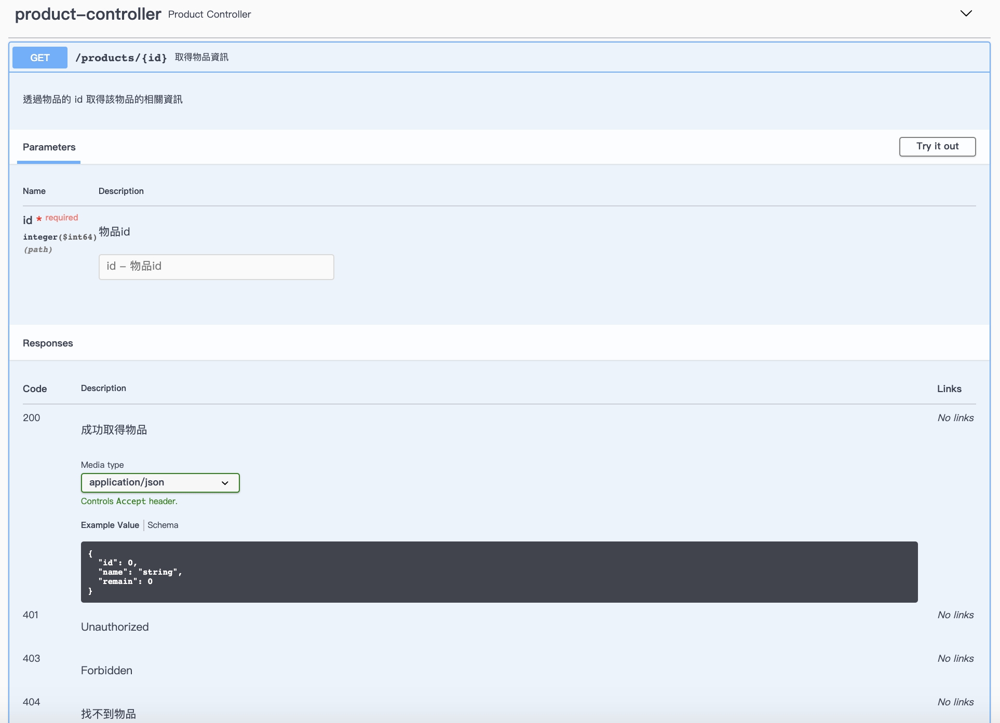
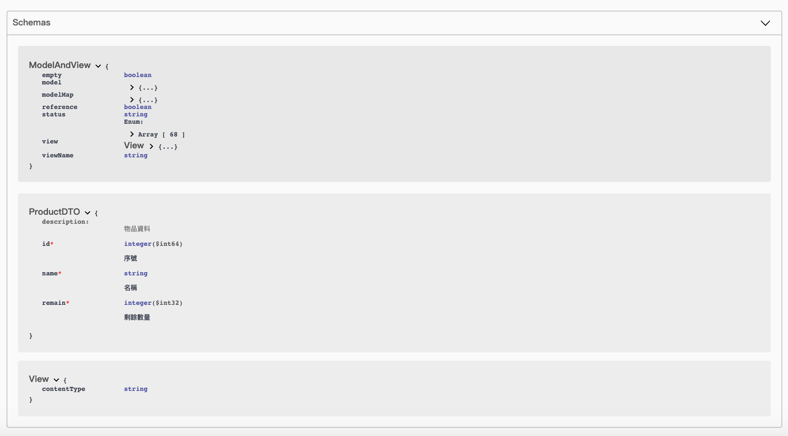

# Springfox Swagger

Swagger 是一套遵循 OpenAPI 規範的開源工具，幫助我們快速的設計、建構 RESTful API，透過 Swagger Codegen 產生出OpenAPI 所規範的 JSON 文件。

> OpenAPI 是一種對於 RESTful API 描述格式的規範，其定義了將 API 的內容以 YAML 或 JSON 的格式撰寫，以包含整份 API 文件的細節說明。

Springfox 將 Swagger 封裝為可以整合至基於 Spring 生態系統的套件，並且提供了 springfox-swagger-ui 將 Swagger UI 整合至 Server 端。

> 2.x and 3.0 的 Springfox 使用方式有些許不一樣
>
> 除了 Springfx 以外，也可以使用 springdoc-openapi 產生 swagger API 文件 

繼續使用上次的專案結果，並從以下選定一種方式配置 swagger
> 本文章使用 3.0

## Springfox 2.x

在 pom.xml 加入

```xml
<dependency>
  <groupId>io.springfox</groupId>
  <artifactId>springfox-swagger2</artifactId>
  <version>2.9.2</version>
</dependency>
<dependency>
  <groupId>io.springfox</groupId>
  <artifactId>springfox-swagger-ui</artifactId>
  <version>2.9.2</version>
</dependency>
```

新建 SwaggerConfiguration.java

```java
@Configuration
@EnableSwagger2
public class SwaggerConfig {
    @Bean
    public Docket api() {
        return new Docket(DocumentationType.SWAGGER_2)
              .select()
              .apis(RequestHandlerSelectors.any())
              .paths(PathSelectors.any())
              .build();
    }
}
```

* `@EnableSwagger2` 啟用 Swagger UI
* `@Bean` 的 `api()` 可用來修改 Swagger UI 的配置，例如設定文件 title 、版本等。

之後可以用 

* `http://localhost:8080/v2/api-docs`: 取得 OpenAPI 的 JSON 格式 API 文件

* `http://localhost:8080/swagger-ui.html`: 進入 Swagger UI 的頁面

## Springfox 3.0

```xml
<dependency>
  <groupId>io.springfox</groupId>
  <artifactId>springfox-boot-starter</artifactId>
  <version>3.0.0</version>
</dependency>
```

> 3.0 版本簡化了許多配置，只需要加入 springfox-boot-starter 。

若要修改配置則創建 SwaggerConfiguration.java

```java
@Configuration
public class SwaggerConfiguration {
public SwaggerConfiguration() {}
  @Bean
  public Docket swaggerSetting() {
    return new Docket(DocumentationType.OAS_30)
      .apiInfo(apiInfo())
      .select()
      .paths(PathSelectors.any())
      .build();
  }
  private ApiInfo apiInfo() {
    return new ApiInfoBuilder()
      .title("Management System Documentation")
      .description("learning Spring Boot")
      .version("0.0")
      .build();
  }
}
```

就可以透過

* `http://localhost:8080/v2/api-docs` or `http://localhost:8080/v3/api-docs`: 進入 v2 or v3 版本的 OpenAPI 文件
* `http://localhost:8080/swagger-ui/index.html` or 
`http://localhost:8080/swagger-ui/` : 進入 Swagger UI

> 注意：http://localhost:8080/swagger-ui/ 結尾一定要加上 "/"。

無論是 2.x 或 3.0 都是用 Docket 進行文件的設定，在 new Docket() 可以進行設定，DocumentationType 有幾個類型可以選擇：
* DocumentationType.SWAGGER_12：swagger 1.2
* DocumentationType.SWAGGER_2：swagger 2.0
* DocumentationType.OAS_30：openApi 3.0

## Springfox 的 Annotation

透過 Annotation 可以很快地寫好 API 文件

### Controller 

如下範例

```java
@ApiOperation(value="取得物品資訊", notes="透過物品的 id 取得該物品的相關資訊")
@ApiResponses({
	@ApiResponse(responseCode="200", description="成功取得物品"),
	@ApiResponse(responseCode="404", description="找不到物品")
})
@GetMapping(value="/{id}", produces={MediaType.APPLICATION_JSON_VALUE})
public ResponseEntity<ProductDTO> getBook(
	@ApiParam("物品id") @PathVariable Long id
) {
	ProductDTO _product = this.products.get(id);
	if (_product == null) {
		return ResponseEntity.status(HttpStatus.NOT_FOUND).body(null);
	} else {
		return ResponseEntity.status(HttpStatus.OK).body(_product);
	}
}
```

* `@ApiOperation`: 設定該 API 的使用說明
* `@ApiResponses`: 設定該 API 回傳的說明
* `@ApiParam`: 設定 API 參數的說明

執行後長相如下



### Model 

如下範例

```java
@AllArgsConstructor
@Data
@ApiModel(description = "物品資料")
public class ProductDTO {
    @ApiModelProperty(value = "序號", required = true)
    private Long id;        // 產品的ID
    @ApiModelProperty(value = "名稱", required = true)
    private String name;    // 產品的名稱
    @ApiModelProperty(value = "剩餘數量", required = true)
    private Integer remain; // 產品的剩餘數量
}
```

執行後長相如下



## 使用 Swagger 套件產生靜態 HTML文件

如果只能透過啟動服務才能產生 API 文件，總是有點不便

更多時候會希望自動儲存最新版本的 API 文件

有兩種方式可以產生 HTML 文件

* 透過 pom.xml 內的 plugin 
* 透過 java -jar

> 無論是哪一種方式，都「必須已經存在符合 Opendata API 規範的 Swagger api-doc，其可為 JSON 或 YAML 的格式」。例如已經存在一個 api-doc.json 或 api-doc.yml，或是在線上的 http://localhost:8080/v2/api-docs 也可以。

### 在 pom.xml

加入

```xml
<plugin>
  <groupId>io.swagger</groupId>
  <artifactId>swagger-codegen-maven-plugin</artifactId>
  <version>2.3.1</version>
  <executions>
    <execution>
      <goals>
        <goal>generate</goal>
      </goals>
      <configuration>
        <inputSpec>./resources/api.yaml</inputSpec>
        <language>html</language>
        <output>./target/gen-swagger-res</output>
      </configuration>
    </execution>
  </executions>
</plugin>
```

接下來就可以指定要在哪個 phase 的時候執行這個 plugin 的 goal (generate)。

* inputSpec 為 api-doc 的檔案路徑或 URL 路徑；
* language 是代表想要透過這個 api-doc 來產生出怎樣的內容
* 將 language 設定為 html ，則可以在 output 的路徑下產生出靜態的 html api 文件。

> 更多的內容請參考[這裡](https://github.com/swagger-api/swagger-codegen/tree/master/modules/swagger-codegen-maven-plugin)

### 使用 java -jar

先下載 [swagger-generator-3.0.21-sources.jar](https://repo1.maven.org/maven2/io/swagger/codegen/v3/swagger-generator/3.0.21/swagger-generator-3.0.21-sources.jar)

> 可以[在此](https://repo1.maven.org/maven2/io/swagger/codegen/v3/swagger-generator/3.0.21/) 找到其他版本

透過 java 執行 jar 檔，產生靜態的 HTML API doc

```sh
java -jar swagger-generator-3.0.21-sources.jar generate -i http://localhost:8080/v2/api-docs -l html -o /target/gen-swagger-res
```

* -i 就是 inputSpec
* -l 就是 language
* -o 就是 output

透過加入 Swagger 可以讓我們達成「寫 code 的同時就在寫文件」，甚至團隊會有共同的文件格式。